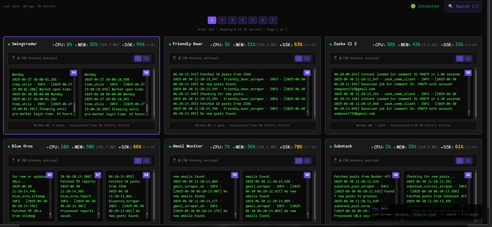
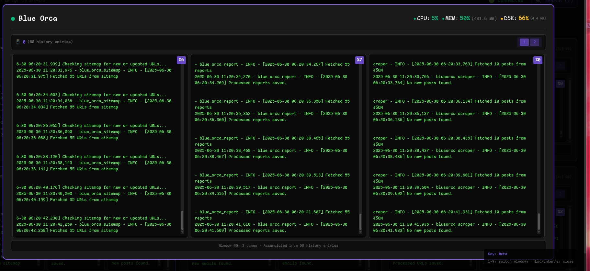

# Server Management - Tmux Monitor

A real-time server monitoring system with tmux session viewing, keyboard navigation, and clean terminal-inspired interface.





## 🎯 **Overview**

Monitor multiple servers with live tmux content, system stats, and vim-like keyboard navigation. Built for sysadmins who prefer terminal workflows.

**Key Features:**
- 🖥️ **Real-time tmux monitoring** - See live terminal content from remote servers
- ⌨️ **Keyboard-driven interface** - Navigate with hjkl, search with `/`, zoom with `:zoom`
- 📊 **System monitoring** - CPU, memory, disk usage with red/green indicators
- 🎮 **Dual modes** - Command mode (for vimmer's) and Normal mode (for fucking normies)
- 📱 **Responsive design** - 6→4→2 server grid based on screen size
- 💾 **Data persistence** - Survives server restarts with JSON storage

## 📋 **Requirements**

- **Go 1.21+** (only for building from source)
- **tmux** (on child servers)

## 🚀 **Installation**

### Option 1: Build from Source (Recommended for Central server)

**Central Server:**
```bash
git clone https://github.com/dhextras/server_managment.git
cd server_managment/central-server
go mod tidy
mkdir -p build
go build -o build/central-server
./build/central-server
```

**Child Monitors:**
```bash
git clone https://github.com/dhextras/server_managment.git
cd server_managment/child-monitor
go mod tidy
mkdir -p build
go build -o build/child-monitor
./build/child-monitor
```

### Option 2: Download Binaries

**Just want the binaries?** 
👉 **[Go to Releases Page](https://github.com/dhextras/server_managment/releases/latest)** 👈

Download for your platform:
- `central-server-linux-amd64` / `central-server-windows-amd64.exe`
- `child-monitor-linux-amd64` / `child-monitor-windows-amd64.exe`


**Central Server:**
```bash
mkdir -p server_managment
cd server_managment
wget https://github.com/dhextras/server_managment/releases/latest/download/central-server-linux-amd64
chmod +x central-server-linux-amd64
./central-server-linux-amd64
```

**Child Monitors:**
```bash
mkdir -p server_managment
cd server_managment
wget https://github.com/dhextras/server_managment/releases/latest/download/child-monitor-linux-amd64
chmod +x child-monitor-linux-amd64
./child-monitor-linux-amd64
```

## 🎮 **Usage**

**Access Dashboard:** `http://your-central-server:8081` || `https://yourcustomdomain.com` hosted with caddy

### Command Mode
- `j/k` - Navigate servers up/down
- `h/l` - Navigate servers left/right
- `/web` - Search for servers containing "web"
- `:zoom api` - Zoom server containing "api"  
- `Enter/z` - Zoom current selected server
- `Esc` - Exit zoom/cancel

### Normal Mode
- Click to select servers
- Double-click to zoom
- Mouse-driven interaction
- Toggle mode button in header

## 📁 **Project Structure**

```
server_managment/
├── .github                  # CI/CD piplines
├── central-server/          # Central monitoring server
│   ├── main.go
│   ├── types/               # Data structures
│   ├── storage/             # JSON persistence
│   ├── tcp/                 # TCP data receiver
│   ├── websocket/           # WebSocket real-time updates
│   ├── http/                # HTTP API
│   ├── web/                 # Frontend React app
│   └── data/                # JSON data files (auto-created)
├── child-monitor/           # Child data collector
│   ├── main.go
│   ├── config/              # Configuration management
│   ├── network/             # TCP sender
│   ├── logger/              # File logging
│   ├── tmux/                # Tmux interface
│   ├── ui/                  # Interactive terminal UI
│   ├── collector/           # System stats
│   └── logs/                # Daily log files (auto-created)
└── README.md
```

## 🔧 **Configuration**

### Central Server
Runs on ports **8080** (TCP) and **8081** (HTTP). 
Edit `config.json` to customize:
```json
{
  "tcp_port": "8080",
  "http_port": "8081", 
  "stale_threshold_seconds": 5,
  "dead_threshold_seconds": 10
}
```

<!-- NOTE: THIS NEEED TO BE CHNAGED -->
### Child Monitor
First run creates interactive setup. Config saved to `monitor_config.json`:
```json
{
  "server_name": "web-server-01",
  "central_server_ip": "10.0.1.1",
  "central_port": "8080",
  "session_name": "main-session"
}
```

## 📊 **Server States**

- **🟢 Active**: Receiving data (< 5 seconds old)
- **🟡 Stale**: Data is 5-10 seconds old  
- **🔴 Dead**: No data for 10+ seconds

## 🔍 **API Endpoints**

| Endpoint | Description |
|----------|-------------|
| `/api/health` | Server health statistics |
| `/api/servers` | All connected servers |
| `/api/servers/{name}` | Specific server data |
| `/ws` | WebSocket real-time updates |
