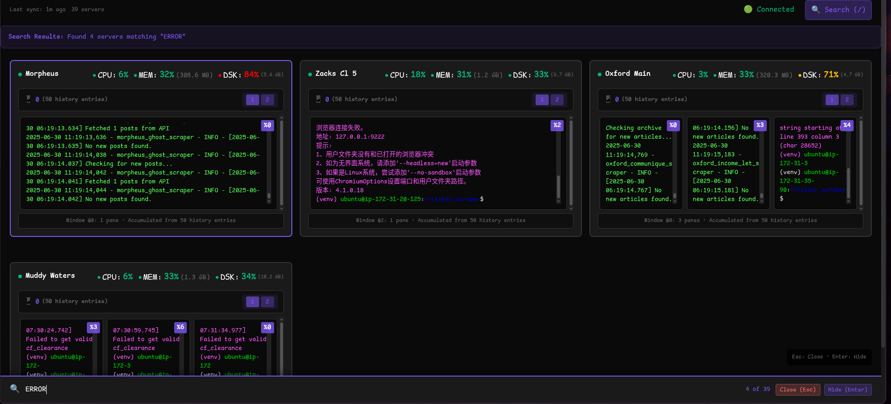

# Server Management - Tmux Monitor

A real-time server monitoring system with tmux session viewing, keyboard navigation, and clean terminal-inspired interface.





## **Overview**

Monitor multiple servers with live tmux content, system stats, and vim-like keyboard navigation. Built for sysadmins who prefer terminal workflows.

**Key Features:**
- **Real-time tmux monitoring** - See live terminal content from remote servers
- **Keyboard-driven interface** - Navigate with hjkl, search with `/`, zoom with `z`
- **System monitoring** - CPU, memory, disk usage with red/green indicators
- **Responsive design** - 6→4→2 server grid based on screen size
- **Data persistence** - Survives server restarts with JSON storage

## 📋 **Requirements**

- **Go 1.21+** (only for building from source)
- **tmux** (on child servers)

## 🚀 **Installation**

### Option 1: Build from Source (Recommended for Central server)

**Central Server:**
```bash
git clone https://github.com/dhextras/server_management.git
cd server_management/central-server
go mod tidy
mkdir -p build
go build -o build/central-server
./build/central-server
```

**Child Monitors:**
```bash
git clone https://github.com/dhextras/server_management.git
cd server_management/child-monitor
go mod tidy
mkdir -p build
go build -o build/child-monitor
./build/child-monitor
```

### Option 2: Download Binaries

**Just want the binaries?** 
👉 **[Go to Releases Page](https://github.com/dhextras/server_management/releases/latest)** 👈

## 🎮 **Usage**

**Access Dashboard:** `http://your-central-server:8081` || `https://yourcustomdomain.com` hosted with caddy

### for Vimmer's

- `j/k/arrows` - Navigate servers up/down | In zoomed mode change servers prev/next
- `h/l/arrows` - Navigate servers left/right
- `/web` - Search for servers containing "web"
- `1-9` - Change pages | In zoomed mode switch windows
- `Enter/z` - Zoom current selected server | Exit zoom
- `Esc` - Exit zoom

### For fucking normies

- Just move your mouse and click LOL

## 📁 **Project Structure**

```
server_management/
├── .github                  # CI/CD piplines
├── central-frontend/        # Frontend ( React+Vite )
├── central-server/          # Central monitoring server
│   ├── main.go
│   ├── types/               # Data structures
│   ├── storage/             # JSON persistence
│   ├── tcp/                 # TCP data receiver
│   ├── websocket/           # WebSocket real-time updates
│   ├── http/                # HTTP API
│   └── data/                # JSON data files (auto-generated)
├── child-monitor/           # Child data collector
│   ├── main.go
│   ├── config/              # Configuration management
│   ├── network/             # TCP sender
│   ├── logger/              # File logging
│   ├── tmux/                # Tmux interface
│   ├── ui/                  # Interactive terminal UI
│   ├── collector/           # System stats
│   └── logs/                # Daily log files (auto-generated)
└── README.md
```

## 📊 **Server States**

- **🟢 Active**: Receiving data (< 5 seconds old)
- **🟡 Stale**: Data is 5-10 seconds old  
- **🔴 Dead**: No data for 10+ seconds
